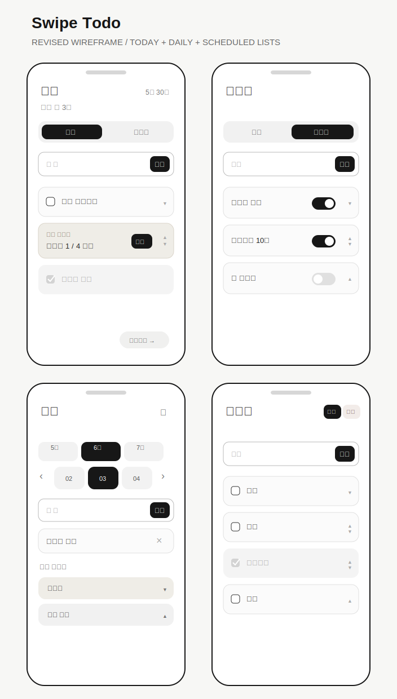

# Swipe Todo

> 오늘 할 일과 매일 반복할 루틴은 가볍게 확인하고,
> 미래 일정과 목적별 준비 목록은 날짜에 미리 적어두는 모바일 PWA 투두리스트

## Project Status

- Role: Product Planner
- Stage: Clickable prototype
- Platform: iPhone-first PWA web application
- Constraint: No login in the first release

## Background

매일 반복되는 일과 오늘 실행할 일은 자주 확인해야 하지만, 미래 일정까지
한 화면에 섞이면 현재 할 일에 집중하기 어렵습니다. `Swipe Todo`는 기본
화면을 `오늘 / 데일리`로 단순하게 유지하고, 화면을 넘겨 날짜별 할 일과
장보기, 여행 준비 같은 목적별 목록을 미리 기록하도록 설계한 서비스입니다.

## Core Concept

| 화면 | 목적 |
| --- | --- |
| 오늘 | 지금 처리할 일 확인 및 완료 |
| 데일리 | 매일 자동으로 생성할 반복 루틴 관리 |
| 계획 | 특정 날짜의 할 일을 미리 작성 |
| 목적별 리스트 | 장보기, 여행 준비처럼 별도 체크리스트 작성 |

기본 화면에서 옆으로 넘기면 `계획` 화면이 나타납니다. 미리 작성한
일반 항목은 지정 날짜가 되면 자동으로 `오늘` 목록에 들어옵니다. 목적별
리스트는 오늘 화면에 카드로 표시되고, 열면 해당 체크리스트만 볼 수 있습니다.

## Why PWA

- iPhone 홈 화면에 추가해 앱처럼 빠르게 실행할 수 있습니다.
- App Store 심사 없이 배포하고 테스트할 수 있습니다.
- Java/Spring Boot 기반 웹 프로젝트로 확장할 수 있습니다.

PWA는 iPhone의 네이티브 홈 화면 위젯을 제공하지 않습니다. 이번 MVP에서는
위젯 대신 홈 화면에서 빠르게 접근하는 모바일 경험을 검증합니다.

## Clickable Prototype

실행 파일: [index.html](index.html)

현재 저장소가 비공개이므로 GitHub Pages 공개 배포는 보류합니다.

- `오늘 / 데일리` 탭 전환
- 계획 화면 이동, 3개월 빠른 선택, 달력 날짜 이동
- 목적별 리스트 편집 페이지에서 등록/삭제 후 선택 날짜에 반영
- 오늘 할 일, 목적별 리스트, 데일리 루틴 순서 변경
- 할 일 추가와 완료 체크

프로토타입은 화면 흐름 검증을 위해 `localStorage`를 사용합니다. 실제 MVP에서는
기획 정책에 맞춰 `IndexedDB` 기반 저장으로 구현할 예정입니다.

## PWA Setup

- [manifest.webmanifest](manifest.webmanifest): 홈 화면 설치용 앱 이름, 색상, 아이콘 정의
- [service-worker.js](service-worker.js): 기본 앱 셸 캐시 및 오프라인 재실행 준비
- [icons/app-icon.svg](icons/app-icon.svg): 프로토타입 앱 아이콘

Service worker는 `http://` 또는 `https://` 환경에서만 등록됩니다. `file://`로
열 때는 일반 정적 프로토타입처럼 동작합니다.

## Test

```bash
npm test
```

Node 기본 테스트 러너로 주요 투두 흐름을 검증합니다.
`npm`이 없는 환경에서는 아래 명령으로 직접 실행할 수 있습니다.

```bash
node --test tests/todo.test.cjs
```

## MVP Scope

- 기본 화면의 `오늘 / 데일리` 탭
- 할 일 추가, 완료, 삭제
- 월 버튼 또는 달력으로 날짜를 선택해 미래 할 일 작성
- 지정 날짜가 되면 예약 항목을 `오늘`에 자동 반영
- 날짜별 `장보기`, `여행 준비` 같은 목적별 체크리스트 생성
- 오늘 도착한 목적별 리스트만 단독 화면에서 확인 및 체크
- `데일리` 항목을 매일 `오늘`에 자동 반영
- 로그인 없는 기기 내부 저장
- PWA 홈 화면 설치 및 오프라인 재실행

## Wireframe



## Deliverables

- [Portfolio Case Study](docs/PORTFOLIO_CASE_STUDY.md)
- [Product Brief](docs/PRODUCT_BRIEF.md)
- [User Flow & Screen Definition](docs/USER_FLOW.md)
- [Wireframe](docs/WIREFRAME.md)
- [Feature Policy](docs/FEATURE_POLICY.md)
- [MVP Backlog](docs/MVP_BACKLOG.md)

## Future Opportunities

- 로그인 및 여러 기기 동기화
- 알림과 마감 시간
- 완료 기록 및 루틴 달성률
- 네이티브 iOS 앱/위젯 확장 검토
