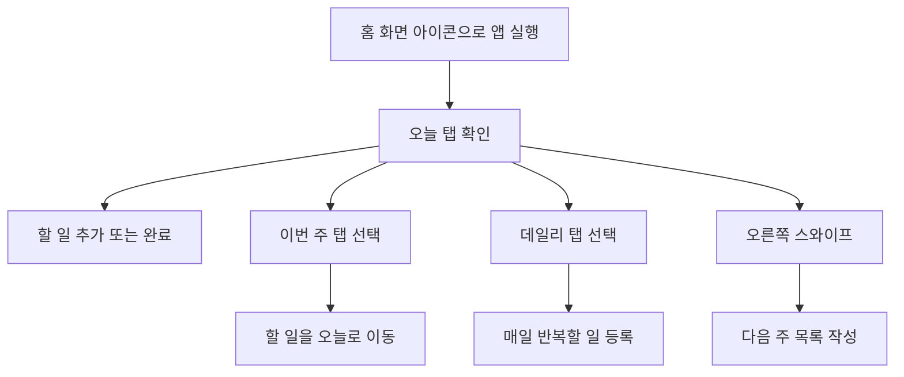
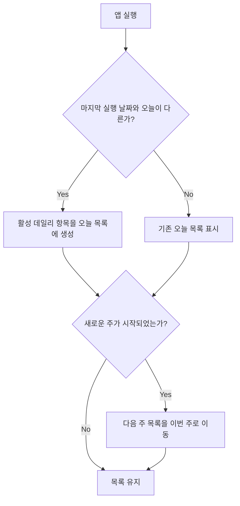

# Swipe Todo - User Flow & Screen Definition

## 1. 주요 사용자 흐름



## 2. 자동 처리 흐름



## 3. 화면 구성

### 기본 화면

```text
┌────────────────────────────┐
│ Swipe Todo       5월 27일   │
│ 오늘 남은 일 3개             │
├────────────────────────────┤
│ [오늘]   [이번 주]  [데일리] │
├────────────────────────────┤
│ + 할 일을 입력하세요   [추가] │
│                            │
│ □ 서류 제출하기             │
│ □ 운동 20분                 │
│ ☑ 영양제 먹기               │
│                            │
│                 → Swipe     │
└────────────────────────────┘
```

### 다음 주 화면

```text
┌────────────────────────────┐
│ 다음 주 준비                 │
│ ← 기본 목록으로 돌아가기      │
├────────────────────────────┤
│ + 다음 주 할 일 입력   [추가] │
│                            │
│ □ 주간 회고 작성             │
│ □ 미용실 예약                │
│                            │
│ 다음 주 월요일에 이번 주로 이동│
└────────────────────────────┘
```

## 4. 탭별 동작

| 화면 | 비어 있을 때 안내 | 항목 행동 |
| --- | --- | --- |
| 오늘 | 오늘 할 일을 추가해보세요 | 완료, 삭제 |
| 이번 주 | 이번 주 계획을 적어보세요 | 오늘로 이동, 삭제 |
| 데일리 | 매일 반복할 일을 등록하세요 | 활성화/비활성화, 삭제 |
| 다음 주 | 미리 준비할 일이 있나요? | 삭제 |

## 5. 인터랙션 원칙

- 앱 실행 직후 `오늘` 탭을 표시합니다.
- 다음 주 화면은 탭을 상시 노출하지 않고 스와이프로 접근합니다.
- 자동 이동된 항목에는 최초 표시 시 `이번 주로 이동됨` 안내를 짧게 보여줍니다.
- 완료된 오늘 항목은 같은 화면 하단에 흐리게 남겨 성취를 확인할 수 있게 합니다.
