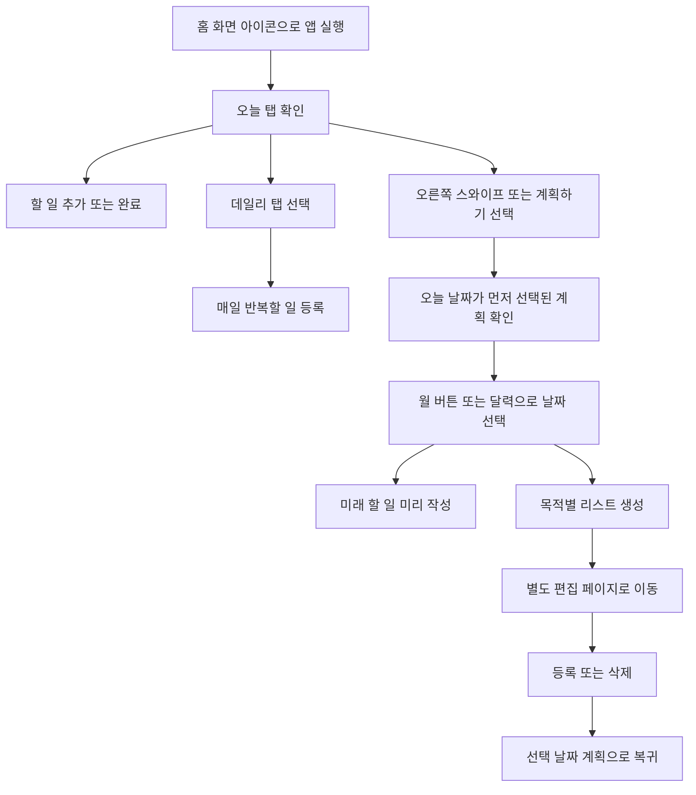
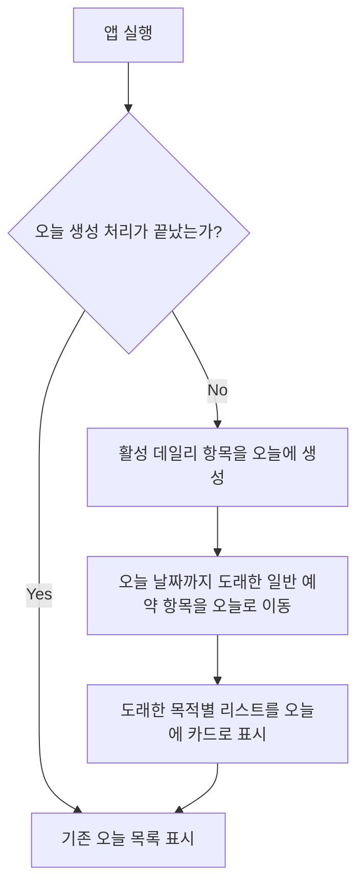

# Swipe Todo - User Flow & Screen Definition

## 1. 주요 사용자 흐름



## 2. 자동 처리 흐름



## 3. 화면 구성

### 기본 화면

```text
┌────────────────────────────┐
│ Swipe Todo       5월 30일   │
│ 오늘 남은 일 3개             │
├────────────────────────────┤
│ [오늘]          [데일리]     │
├────────────────────────────┤
│ + 할 일                [추가] │
│                            │
│ □ 서류 제출하기             │
│ □ 운동 20분                 │
│ ▣ 장보기 목록 (4)     [열기] │
│ ☑ 영양제 먹기               │
│                            │
│               계획하기 →    │
└────────────────────────────┘
```

### 계획 화면

```text
┌────────────────────────────┐
│ 계획                         │
│ 닫기   오늘   [달력]          │
├────────────────────────────┤
│  5월   6월   7월       [달력] │
│  ←  2일   [3일]   4일      → │
├────────────────────────────┤
│ + 할 일                [추가] │
│                            │
│ □ 미용실 예약                │
│ [장보기] [여행 준비] [+ 리스트]│
│                            │
│ 해당 날짜에 오늘로 이동       │
└────────────────────────────┘
```

### 목적별 리스트 화면

```text
┌────────────────────────────┐
│ 장보기             5월 30일 │
│ 닫기                         │
├────────────────────────────┤
│ + 항목                 [추가] │
│                            │
│ □ 우유                       │
│ □ 사과                       │
│ ☑ 주방세제                   │
└────────────────────────────┘
```

## 4. 화면별 동작

| 화면 | 비어 있을 때 안내 | 항목 행동 |
| --- | --- | --- |
| 오늘 | 오늘 할 일을 추가해보세요 | 완료, 삭제 |
| 데일리 | 매일 반복할 일을 등록하세요 | 추가 시 기본 미사용, 활성화/비활성화, 삭제 |
| 계획 | 미리 준비할 일을 적어보세요 | 월/날짜 선택, 일반 할 일/리스트 추가, 순서 변경 |
| 목적별 리스트 | 필요한 항목을 적어보세요 | 항목 추가, 완료, 등록, 삭제 |

## 5. 인터랙션 원칙

- 앱 실행 직후 `오늘` 탭을 표시합니다.
- 계획 화면은 스와이프와 `계획하기` 버튼 모두로 접근합니다.
- `계획하기`를 누르면 선택 날짜는 오늘로 초기화합니다.
- 오늘 화면에서 오른쪽으로 스와이프하면 계획으로 이동합니다.
- 계획 화면에서 왼쪽으로 스와이프하면 오늘로 돌아갑니다.
- 예약 항목이 오늘로 이동되면 최초 표시 시 `미리 작성한 할 일이 도착했어요`를 보여줍니다.
- 목적별 리스트는 오늘에 카드로 표시하며, 카드 선택 시 해당 목록만 보여줍니다.
- 오늘 할 일과 리스트, 데일리 루틴, 별도 리스트 항목은 오른쪽 삼각형으로 순서를 정합니다.
- 계획에서 연 목적별 리스트를 등록하거나 삭제하면 기존에 선택한 날짜 화면으로 돌아갑니다.
- 완료된 오늘 항목은 같은 화면 하단에 흐리게 남겨 성취를 확인할 수 있게 합니다.
